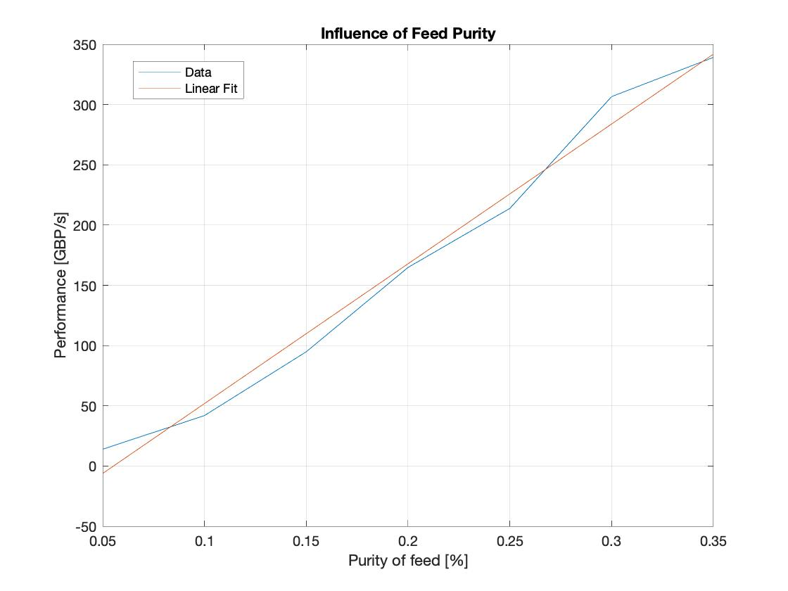
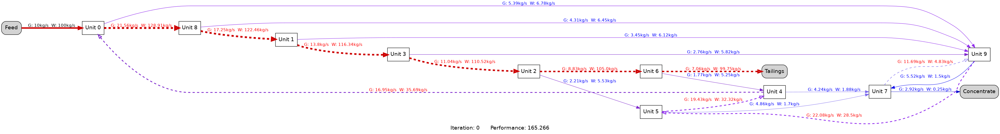

# ACSE 4.2: Gormanium Rush

## Team Galena

- Iñigo Basterretxea Jacob (inigo.basterretxea-jacob16@imperial.ac.uk)
- Gordon Cheung (yat.cheung16@imperial.ac.uk)
- Nina Kahr (nina.kahr20@imperial.ac.uk)
- Miguel Pereira (miguel.pereira20@imperial.ac.uk)
- Ranran Tao (ranran.tao20@imperial.ac.uk)
- Suyan Shi (suyan.shi20@imperial.ac.uk)
- Jihao Xin (jihao.xin20@imperial.ac.uk)
- Jie Zhu (jie.zhu20@imperial.ac.uk)

## Setup

This repo requires the use of [gcc compiler](https://gcc.gnu.org/) for compiling the `C++` source code of the optimisation algorithm, and [Conda](https://docs.conda.io/en/latest/) for package and environment management for the post-processing.

## Compilation

This repository utilises `Makefile` to handle the dependencies and includes when compiling `C++` into executables, which can be run by
`make`
in the root directory, with the respective executables located in the `bin/` folder.

## Running Tests

A python script `run_tests.py` had been set up to execute the compiled tests executables located in `tests/bin`, which can be run like a normal python script
`python run_tests.py`.

To compile and run all tests, you can use the following command:
`make runtests`

The test files can also be run individually by executing each executable.

## Genetic Algorithm

- `vector<int> Genetic_Optimization` is the main genetic optimisation solver function. It can be customised via various model parameters such as:
    ```
    int population_size,
    int max_iterations,
    int threshold,
    vector<double> &adaptive_rate,
    int num_units,
    double flow_rate_gormanium,
    double flow_rate_waste,
    double price_gormanium,
    double cost_waste
    ```
    Further details and description on the effect of these model parameters can be found in the documents. An example of how to utilise this solver function is provided in `main.cpp`

- `double Evaluate_Circuit()` calculates the performance of a given circuit with a set of parameters (e.g. no. of units, price of gormanium, cost of waste...), so that relationships between these and the resulting optimum circuit can be derived. The parameters are set as default arguments to the function, with the default values being those of the base case provided in the brief. An error will be thrown if mass continuity is violated, as we assume steady-state conditions.

- `void Evaluate_Flows()` gets called by `double Evaluate_Circuit()` to run the successive substituion algorithm that, once convergence to the steady-state mass flow rates is achieved, allows the performance to be calculated using the destination concentrate flow rate. This function can be called directly by the user to pass the steady-state mass flows by reference. Similarly to `double Evaluate_Circuit()`, the parameters are set to default values. The user will be prompted if convergence is not achieved after `n` iterations.

## Postprocessing

The visualisation of the circuit is done through the use of [graphviz](https://graphviz.org/), with a python script `visualization/visualisation/py` as the interface.
To set up the environment and dependencies, it is best through the use of `conda` and the `environment.yml` file. The environment can be set up using
`conda env create -f environment.yml`
Which can be subsequently activated by
`conda activate gormanium_visualise`
The visualisation script can then be executed by
`python visualisation.py`
Running this script will by default visualise all the graph data files located in the `data/` folder. Additional options allow user to input cicruits they want to visualise directly in the python script. This interfaces with the `void utils::Print_Circuit_To_File` function, which writes circuit data files into the `data/` folder in the solver executables. Details of the format of the data files can be found in `data/Note`.

Further details of this postprocessing sub-module can be found in `visualization/README.md`.

Points of Caution:

- In some Mac systems the path to `graphviz` cannot be recognised, this can likely be resolved by installing `graphviz` through the [conda port](https://anaconda.org/anaconda/graphviz). Alternatively, `graphviz` may be installed with Homebrew by running `brew install graphviz`. If changing ownership of some files is requested, this may be achieved by running `sudo chown -R $(whoami):admin /usr/local/*`
  `sudo chmod -R g+rwx /usr/local/*` and possibly reinstalling the package with `brew reinstall graphviz`

## Parameter Optimisation




## Base Solution




##  Licence

[MIT](https://choosealicense.com/licenses/mit/)
