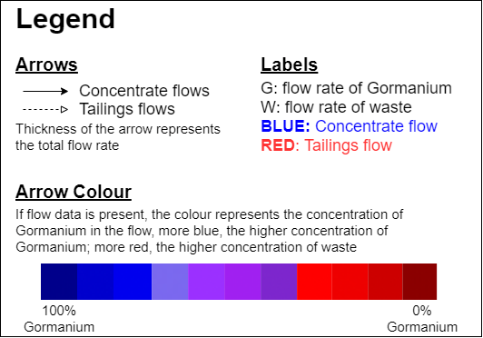

These tools provide basic visualization methods for the the vector output of the genetic algorithm code. They both use the graph
visualization package Graphviz [https://graphviz.gitlab.io](https://graphviz.gitlab.io).

Python version
==============

The example python script requires a working python installation of Graphviz. For conda users a working environment can be 

```
conda env create -f environment.yml
conda activate gormanium_visualise
```

or you can (conda) install the packages yourself
```
conda install graphviz python-graphviz
```


It is known to cause issue if there exist to be a local installation of graphviz through pip. If the script does not render the images properly, try unstalling the current graphviz installations 
```
pip uninstall graphviz
```
and then try setting up the environment as described above.

Using the package
===========

After installing the dependencies, running
```
python visualisation.py
```
will take all the data files in `root/data/` and generate visualisations into the `/figures` folder as `.png` images.


Visualisation Interpretation
=====

